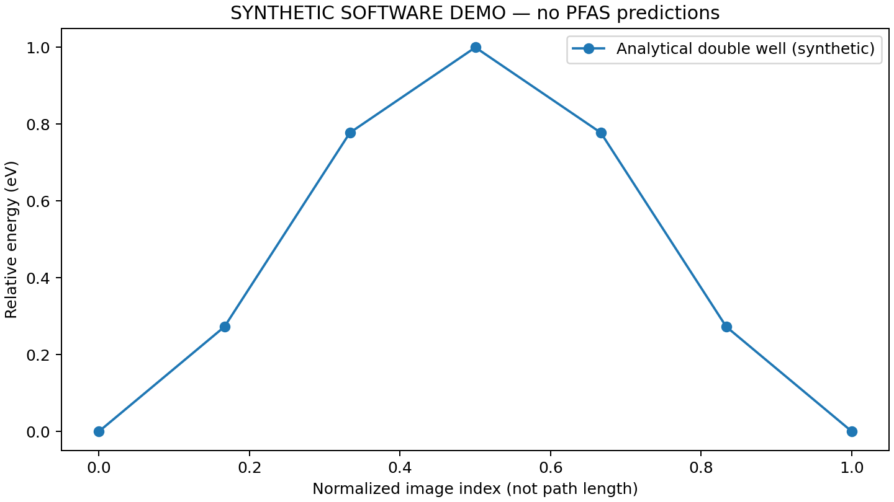

# PFAS Interface DFT

**First-Principles Modeling of PFAS Defluorination on Catalytic Interfaces**

Owner: **[shriyarv260](https://github.com/shriyarv260)** (shriya_v260) · Project period supplied: **May–August 2026** · Version: **0.1.0**

A reproducible Python repository for preparing PFAS–surface systems, running fixed-charge density functional theory (DFT) and climbing-image nudged elastic band (CI-NEB) calculations, and analyzing reaction-energy landscapes. It supports investigation of C–F cleavage, decarboxylation, and desulfonation through explicitly prepared reactant/product structures. Electron-transfer mechanisms have a separate methodological protocol.

> **Scientific status: not validated.** This repository was assembled on September 14, 2026 from the project brief, checked literature, and established open-source scientific software. No historical research activity, new PFAS DFT results, catalyst rankings, or 95% predictive accuracy is asserted. The bundled NEB result is an explicitly synthetic software integration test.

## What runs today

| Component | Included capability | Scientific boundary |
|---|---|---|
| Molecular inputs | PFOA/PFOS acid and anion conformers, formulas, atom maps | RDKit/UFF starting geometries, not DFT minima |
| Interfaces | Cu(111), Pd(111), top-layer vacancy prototypes | Bulk lattice constants and slab settings need convergence |
| Other catalysts | Import reviewed ASE-readable slabs/endpoints | Ti4O7/TiO2 structures are not invented or auto-generated |
| Endpoints | Atom-preserving fragment displacement | User must verify chemistry and relax both endpoints |
| DFT | Quantum ESPRESSO via ASE; relaxation and force checks | External `pw.x`, reviewed pseudopotentials, compute required |
| CI-NEB | IDPP initialization; preclimb then climb; per-image directories | Fixed charge and fixed cell; verify the transition-state mode |
| Analysis | Forward/reverse sampled barriers, reaction energies, PNG plot | Electronic energies are not automatically free energies |
| Benchmarks | Provenance, condition matching, MAE/RMSE and tolerance fraction | Three reference quantities, two independence groups; no predictions |
| Testing | Analytic NEB, force gradients, input preparation, invalid-data checks | Software correctness does not establish DFT accuracy |

## Quick start: executable example

Python 3.11+ and a working Git installation are sufficient for the software example. Run from the repository root:

```bash
python -m venv .venv
source .venv/bin/activate
python -m pip install -c requirements-lock.txt -e '.[dev]'
pytest -q
pfas demo --output runs/demo
```

The example optimizes a curved path on an analytical double-well potential with a known **1.0 eV** barrier. It produces `energies.csv`, trajectories, logs, `profiles.json`, `landscape.png`, and a status record. It describes no PFAS molecule or catalyst.

A verified example run is included in [examples/demo_result](examples/demo_result). Every output is labeled synthetic.



`requirements-lock.txt` records the tested dependency versions; using it as a constraints file keeps optional RDKit uninstalled unless requested.

Output directories for calculations must be new; choose another name to repeat a run. The analysis command may update plots/reports in its output directory.

## Prepare a PFAS calculation

```bash
pfas build --molecule data/structures/pfoa_acid.xyz --metal Cu --output runs/pfoa-cu
pfas write-qe --input runs/pfoa-cu/initial.traj --config configs/qe.example.json --output runs/qe-input
```

`write-qe` writes a template without running DFT or verifying pseudopotential files. Review the cell, adsorption orientation, steric contacts, periodic images, charge state, and spin before execution. The default example uses the neutral acid and a neutral cell. An anion geometry does **not** set the total electronic charge of a surface calculation.

To run real DFT, install Quantum ESPRESSO, place appropriate PBE pseudopotentials in `pseudopotentials/`, and edit a copy of `configs/qe.example.json` with exact filenames and converged settings. `60/480 Ry`, `2×2×1`, and `0.03 eV/Å` are starting choices, not literature reproduction settings or certified convergence. Pseudopotential files are not redistributed.

```bash
pfas relax --input runs/pfoa-cu/initial.traj --config configs/qe.example.json --output runs/reactant
# Prepare and inspect a product guess using the atom maps; retain every atom.
# pfas endpoint --initial runs/reactant/final.traj --indices INDEX ... --shift DX DY DZ --output runs/product-guess.traj
# Relax that product, then use the actual endpoint paths:
# pfas relax --input runs/product-guess.traj --config configs/qe.example.json --output runs/product
# pfas prepare-neb --initial runs/reactant/final.traj --final runs/product/final.traj --images 7 --output runs/path
# pfas neb --input runs/path/images.traj --config configs/qe.example.json --output runs/neb
# pfas analyze --input runs/neb/energies.csv --output runs/analysis
```

The commented commands require chemically reviewed product coordinates. Atom indices and displacements cannot be chosen universally across catalysts. See the [execution guide](docs/WORKFLOW.md) and [scientific protocol](docs/METHODS.md).

## The requested 95% target

The proposed acceptance rule is **at least 95% of a complete, preregistered, condition-matched benchmark set within its declared absolute energy tolerance**, with at least 20 independent cases. This is a measurable project goal, not an established property of DFT. Tolerances must be chosen before seeing predictions; the initial references use a provisional ±0.10 eV tolerance.

```bash
pfas benchmark --references data/benchmarks/references.json --predictions data/benchmarks/predictions.json --output runs/benchmark.json
```

This command currently reports **`not_validated` and exits 2**, intentionally: the prediction list is empty and the reference set is too small. It must never be filled with literature values masquerading as calculations. See [validation rules](docs/VALIDATION.md).

## Research provenance and reused code

- [Raghavan, Chaplin & Mehraeen (2025)](https://doi.org/10.1021/acs.jpcc.5c00542): Ti4O7/PFOA decarboxylation; its downloaded [supporting information](https://doi.org/10.1021/acs.jpcc.5c00542.s001) supplies the checked soluble-radical barrier and Table S2 records.
- [Sharkas & Wong (2025)](https://doi.org/10.1021/acs.estlett.4c01130): constant-potential PFOA chemistry at Cu(111); motivates the electrode-potential boundary.
- [McTaggart & Malardier-Jugroot (2024)](https://doi.org/10.1039/D3CP04973F): electron capture and conformer dependence.
- [Hydrated-electron first-principles study (2022)](https://doi.org/10.1021/acs.est.2c01469): explicit hydrated-electron treatment of PFOA/PFOS.
- [Photo-electrochemical PFAS reduction (2026)](https://doi.org/10.1038/s41467-026-71263-9): PFOS/Pd–TiO2 mechanism and coordinate-data availability; used as a pathway lead, not a reproduced dataset.

The orchestration code is original. It **uses published research code through ASE** (`NEB`, IDPP, FIRE, Espresso, Vibrations) and the external Quantum ESPRESSO engine. It is not copied from the PFAS paper authors, and no unavailable author scripts are represented as recovered. See [third-party notices](THIRD_PARTY_NOTICES.md), the [source ledger](references/sources.json), and [literature notes](docs/LITERATURE.md).

Fetch the audited supplement, verifying its recorded SHA-256:

```bash
python scripts/fetch_supplement.py
```

## Repository map

```text
src/pfas_dft/       CLI, geometry preparation, DFT/NEB, analysis, validation
configs/           QE starting protocol and explicit benchmark policy
data/structures/   Generated conformers and atom/bond provenance
data/literature/   Checked published numerical records
data/benchmarks/   Reference quantities and empty prediction set
data/templates/    Screening and prediction schemas
references/        Source metadata and bibliography
docs/              Methods, execution, validation, source limits, release notes
scripts/           Audited SI download and conformer generation
examples/          Executed synthetic example and generated QE template
hpc/               Configurable Slurm submission template
tests/             Unit and integration tests
.github/           CI and issue/PR templates
```

## Ownership, licensing, and publication

Repository identity is in [repository.json](repository.json); citation metadata is in [CITATION.cff](CITATION.cff). The supplied maintainer label is `shriya_v260`; the verified GitHub account is `shriyarv260`. Public repository: [shriyarv260/pfas-interface-dft](https://github.com/shriyarv260/pfas-interface-dft).

Original software: [MIT](LICENSE). Literature-derived records retain attribution and the upstream SI's CC BY-NC 4.0 terms; they are excluded from the MIT grant. External dependencies retain their own licenses. Do not redistribute pseudopotentials or VASP files without the applicable rights.

Use [CONTRIBUTING.md](CONTRIBUTING.md) for contribution rules and [docs/PUBLISHING.md](docs/PUBLISHING.md) when ready to publish.
